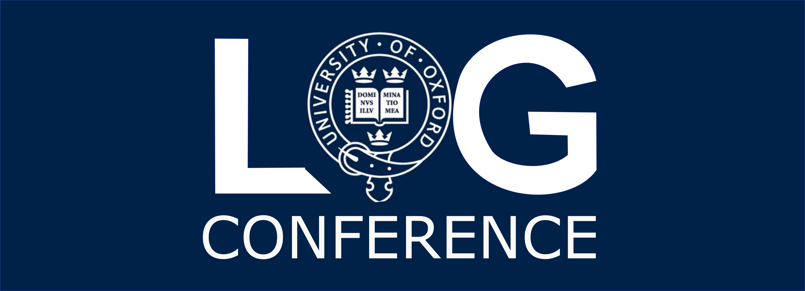

<h1 align="center">
LoG-Ox 2024
</h1>

    

    

Welcome to the website for <strong>LoG-Ox</strong>, the Oxford meetup for the <a href="https://logconference.org">LoG Conference</a>. Hosted by University of Oxford on Nov 25, 2024.

  <a href="#about">About</a> •
  <a href="#dates">Dates</a> •
  <a href="#schedule">Tentative Schedule</a> •
  <a href="#registration">Registration</a> •
  <a href="#contact">Contact</a> •
  <a href="#organisation">Organisation</a>

## About

The LoG-Ox conference is a satellite event of the global LoG Conference, featuring talks, posters and networking opportunities, aiming to bring together the local community in graph machine learning and geometry. Please watch this space for updates!

## Details

* Meet-up on November 25, 2024.
* The event is **free** 🤑 to attend.
* Hosted at Lady Margaret Hall, University of Oxford.

## Dates

* October 29, 2023. Registration opens. First come first served, up to capacity.
* November 18, 2023. Registration closes. After this date we maintain a wait list and registrations are considered up to capacity. 
* November 25. Conference.

## Tentative Schedule

### 25 November

| `Time`      | `Event`             | `Details`                                                                 |
|:------------:|:------------------:|:-------------------------------------------------------------------------|
| 09:30 - 09:40| Welcome            |                                                                           |
| 09:40 - 11:00| Lightning talks 1  | Victor-Alexandru Darvariu: Graph Reinforcement Learning for Combinatorial Optimization   Huidong Liang: Bayesian Optimization on Node Subsets   Emily Jin: Homomorphism Counts Rule Everything Around Me   James Rowbottom: Graph Neural Diffusion for Accelerated Adaptive Mesh Refinement in Finite Element Methods |
| 11:00 - 11:30| Coffee Break 1     |                                                                           |
| 11:30 - 12:30| Keynote 1          | Renaud Lambiotte: Consensus and Random Walks on Higher-Order Networks   |
| 12:30 - 14:00| Lunch              |                                                                           |
| 14:00 - 15:00| Keynote 2          | Anthea Monod: Algebraic geometry learns machines and machines learn algebraic geometry      |
| 15:00 - 15:30| Coffee Break 2     |                                                                           |
| 15:30 - 17:00| Lightning talks 2  | Oleksandr Pryymak: Applying GNNs at scale at Meta Applied AI   Federico Barbero: Limitations of generalization with Transformers    Alexander Davies: Towards Generalised Pre-Training of Graph Models   Xingyue Huang: Link prediction with relational hypergraphs |
| 17:00 - 18:00| Poster Presentations|                                                                          |
| 18:30 - ?    | Social at the Royal Oak | Not included                                                          |

#### Keynotes
##### Keynote 1:
**Speaker:** Renaud Lambiotte   
**Title:** TBC   

##### Keynote 2:

**Speaker:** Anthea Monod   
**Title:** Algebraic geometry learns machines and machines learn algebraic geometry   
**Abstract:**   In this talk I will overview some existing results and ongoing work at the intersection of algebraic geometry and machine learning.  I will present how a piecewise linear and combinatorial variant of algebraic geometry—-known as tropical geometry—-has been shown to be relevant in defining neural networks and talk about some recent and current work that our group is doing that adapts tropical geometry theory in numerical studies towards a better understanding of neural network behavior during training.  While algebraic geometry holds much potential for better understanding machine learning, it turns out that machine learning is also a powerful tool that can help develop algebraic geometry theory.  I will also overview some recent and ongoing work by researchers in my group where we use neural networks for theorem discovery in algebraic geometry.

### 26 November onwards

We will broadcast the conference throughout the week in a designated room. More coming soon.

For the latest info and last minute updates, please join log-ox whatsapp group: [https://chat.whatsapp.com/Fyzh09qVMK35pCqM3kVD3p](https://chat.whatsapp.com/Fyzh09qVMK35pCqM3kVD3p)

On Tuesday (4pm-6pm)we will broadcast the Opening remarks, Keynote, and Oral Presentation from the CS department, Wolsfon Building room 051.

On Wednesday (2pm-5:00pm), we will have the physical tutorial on generative modelin. 

## Registration
Are you interested in attending LoG-Ox? Please register with this [form](https://docs.google.com/forms/d/e/1FAIpQLSfrH97fSxo2tpIjR_8VG-XexxB9clVUfqcAZle38dSgHRfclw/viewform?usp=sf_link).

## Contact

For any inquiries or questions about LoG-Ox, please feel free to get in touch with our organizing team <a href="mailto: log.oxford.2024@gmail.com">here</a>.

## Organisation ##
* Jacob Bamberger 
* Alvaro Arroyo
* Teo Reu
* Xiaowen Dong
* Michael Bronstein

<!--

    

-->

We are part of a global network of local meetups, a list of other meetups can be found [here](https://logconference.org/).
